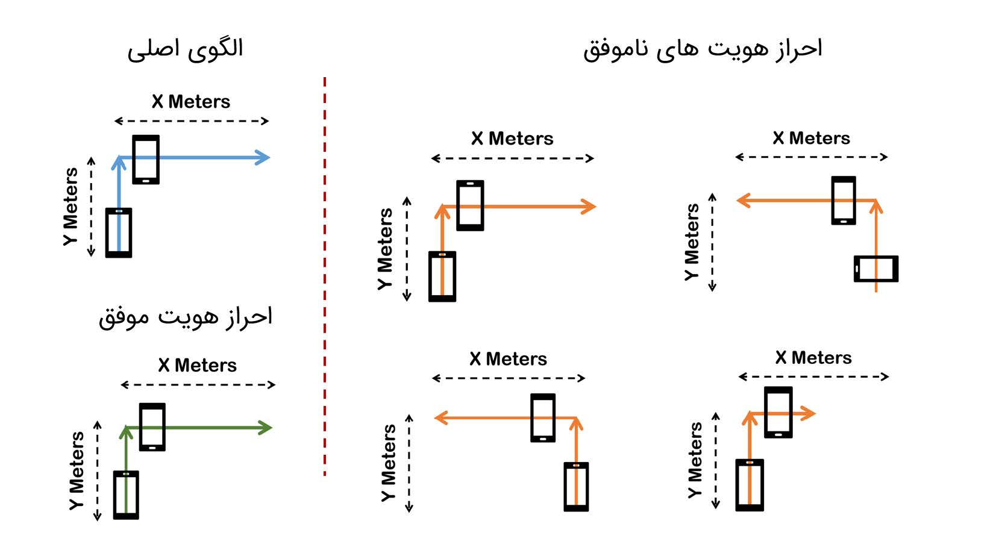
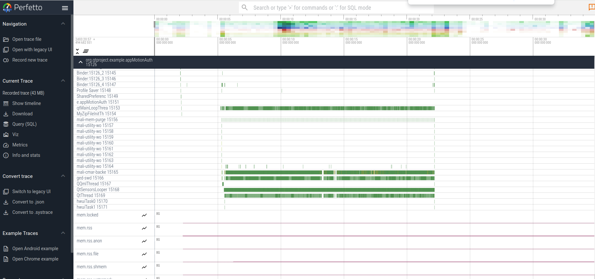

# CA2 - CPS - Motion-Based Authentication Android Application

### Table of Contents  
- [Introduction](#introduction)
- [Preliminary](#preliminary)
    - [Tools and Requirements](#tools-and-requirements)
    - [Experiment Settings](#experiment-settings)
- [Visual Results](#visual-results)
    - [Accept Scenario](#accept-scenario)
    - [Decline Scenario](#decline-scenario)
- [Code Explanation](#code-explanation) 
- [Perfetto](#perfetto)  
- [Other Questions](#other-questions)
- [Conclusion](#conclusion) 

# Introduction

This project is a motion-based authentication application developed for Android devices. It leverages the device's built-in sensors, such as the accelerometer and gyroscope, to capture and recognize user-specific motion patterns. The primary objective is to explore an innovative approach to user authentication, moving beyond traditional methods like passwords or biometrics.

The application is designed to record and store a user's unique motion pattern, which can be used as a "motion signature" for subsequent authentication attempts. During the recording phase, the user performs a series of predefined movements with their device, and the application captures the sensor data associated with these movements. This recorded motion pattern serves as the reference for future authentication attempts.

When a user attempts to authenticate, the application prompts them to repeat the same motion pattern. It then compares the real-time sensor data with the previously recorded motion signature. If the patterns match within a specified tolerance, the application grants access; otherwise, access is denied. This approach introduces an additional layer of security by combining the user's physical motion with the device's sensor data, making it more challenging for unauthorized individuals to replicate or bypass the authentication process.

# Preliminary

## Tools and Requirements

To compile and build this project, the following assumptions and requirements must be met:

- **Qt Framework**: The project is built using the Qt framework, specifically Qt 6.1 or later. Ensure that you have Qt installed on your development environment.
- **Android Development Environment**: Since this application targets Android devices, you'll need to have the Android SDK and Android NDK properly configured in your development environment. Please use versions 26 or higher.
- **CMake**: The project uses CMake as the build system, so you'll need to have CMake installed.

The following tools were used in the development and testing of this project:

- **Qt Creator**: The Qt Creator IDE was used for coding, building, and deploying the application.
- **Android Device**: A physical Android device (Android 13 or later) is required for testing and running the application. An emulator or simulator is not sufficient for this project.

## Experiment Settings

To ensure accurate sensor data and calibration, the following experiment settings were used:

- **Sensor Sampling Rate**: The accelerometer and gyroscope were configured to sample data at a rate of 100Hz and 20Hz, respectively.
- **Noise Filtering**: A low-pass filter was applied to the sensor data to reduce noise and improve accuracy.
- **Threshold Values**: Specific threshold values were set for detecting motion patterns and transitions between different movements.

The project utilizes the following Qt libraries and modules:

- **Qt Quick**: The Qt Quick module was used for developing the user interface and handling user interactions.
- **Qt Sensors**: This module provides access to the device's sensors, including the accelerometer and gyroscope, which are crucial for capturing motion data.
- **Qt Core**: The Qt Core module provides essential functionality for handling data structures, threading, and other low-level operations.

Additionally, the project may incorporate other third-party libraries or dependencies, which will be listed in the project's documentation or source code.

# Visual Results

Before we can describe our code and its components, we will demonstrate the result of this project. The demonstration includes both the scenarios where the user authentication is successful/unsuccessful.

To run the program, we first need to build and run the web server configuration in QT environment.

Below, is the corresponding demographic to record a motion pattern and to replicate it inorder to authenticate yourself successfully.

To run the program, we need to connect the android device to our system (using cable), build the project, and deploy (run) it on our device. Please make sure that the developer options is turned on and also USB debugging is enabled.

## Accept Scenario

## Decline Scenario

> **Note:** We have also implemented a bonus excercise to show the online recorded path. Here is the described scenario:

# Code Explanation

Our coding structure consists of one main file *Main.qml* and some complimentary files *Header.qml, ProgressXYZBar.qml*. We will explain the *Main.qml* file and its functions briefly.

1. **Utility Functions**:
   - `getDirection(degree)`: This function takes an angle in degrees and normalizes it to a value between 0 and 359 degrees. It then maps the normalized angle to one of the four cardinal directions ("0", "90", "-90", or "180") based on the angle range. For example, if the angle is between 315 and 45 degrees, it returns "0" (representing the positive X-axis direction).
   - `getGlobalDirection(localDirection, angle)`: This function takes a local direction (e.g., "top", "left", "down", "right") and an angle (in degrees) representing the device's rotation around the Z-axis. It then calculates the global direction based on the local direction and the rotation angle. This is necessary because the device's orientation can change, and the local directions need to be mapped to the global coordinate system.
   - `getPositionDir(vx, vy)`: This function determines the direction of motion based on the velocity components `vx` (velocity along the X-axis) and `vy` (velocity along the Y-axis). It compares these velocities against a threshold value (`thrv`) and returns the corresponding direction ("right", "left", "top", "down", or "default" if the velocities are below the threshold).
   - `refresh()`: This function resets all sensor values and states to their initial conditions. It sets the gyroscope's `x`, `y`, `z`, and `lastTimeStamp` values to 0, as well as the `underThrCount` (a counter used for detecting stationary periods). Similarly, it resets the accelerometer's `ax`, `ay`, `az`, `lastTimeStamp`, `vx`, `vy`, `vz`, and `underThrCount` values. It also resets the rotation (`rx`, `ry`, `rz`) and position (`px`, `py`, `pz`) values to 0, and sets the `startPos` to (0, 0).
   - `resetButton()`: This function calls the `refresh()` function to reset all sensor values and states, and then clears the `path` and `authPath` arrays, which store the recorded motion path and the authentication path, respectively.

2. **Recording and Authentication**:
   - `startRecording()`: This function sets the `isRecording` property to `true` and calls the `refresh()` function to reset the sensor values and states before starting the recording process.
   - `stopRecording()`: This function sets the `isRecording` property to `false`, effectively stopping the recording process.
   - `startAuthenticating()`: This function sets the `isAutheticating` property to `true` and calls the `refresh()` function to reset the sensor values and states before starting the authentication process. Additionally, it resets the `vx`, `vy`, and `vz` values of the accelerometer to 0.
   - `stopAuthenticating()`: This function sets the `isAutheticating` property to `false`, effectively stopping the authentication process.

3. **Path Management**:
   - `getEndPosition()`: This function calculates the end position of a motion segment based on the current position (`startPos`), the last recorded direction (`lastPosDir`), and the last recorded angle (`lastDir`). It maps the local direction and angle to a global direction using the `getGlobalDirection` function and updates the `startPos` accordingly.
   - `savePath()`: This function first calls `getEndPosition()` to calculate the end position of the current motion segment. It then creates a new object containing the start position, end position, global direction, and angle, and appends it to either the `path` array (if `isRecording` is true) or the `authPath` array (if `isAutheticating` is true). Finally, it updates the `startPos` to the calculated end position for the next motion segment.
   - `checkPath()`: This function compares the recorded `path` with the `authPath`. If the `path` is empty, it returns "Record first". If the lengths of `path` and `authPath` are different, it returns "not matched!". Otherwise, it iterates through both arrays and compares the direction and angle for each motion segment. If any segment's direction or angle does not match, it returns "not matched!". If all segments match, it returns "matched".
   - `generateOnlinePathData()`: This function generates an array of direction strings ("right", "left", "top", "down") representing the recorded motion path. It iterates through the `path` array and appends the corresponding direction for each motion segment to the `onlinePathData` array. This data is used for visualizing the motion path on the canvas.

4. **User Interface**:
   - The main.qml file defines various UI components, such as buttons for starting/stopping recording and authentication, a popup for displaying validation messages, and a canvas for visualizing the motion path.
   - The buttons call the respective functions (`startRecording()`, `stopRecording()`, `startAuthenticating()`, `stopAuthenticating()`, `checkPath()`, and `resetButton()`) when clicked.
   - The `validatePopup` component displays a message based on the result of the `checkPath()` function.
   - The `chartPopup` component contains a `Canvas` element that renders the motion path using the `generateOnlinePathData()` function. It draws line segments and arrowheads for each motion segment, scaling the coordinates based on the canvas size.
   - The UI also includes components for displaying sensor data (accelerometer, gyroscope, and rotation) and position information, using `ProgressBar` and `Text` elements.

5. **Sensor Integration**:
   - The `Gyroscope` component is used to access the device's gyroscope sensor. It provides the angular velocity around the X, Y, and Z axes (`x`, `y`, `z`), which are used to calculate the device's rotation.
   - The `Accelerometer` component is used to access the device's accelerometer sensor. It provides the acceleration values along the X, Y, and Z axes (`ax`, `ay`, `az`), which are used to calculate the device's velocity and position.
   - Both sensor components update their respective values whenever a new reading is available (`onReadingChanged` signal). The `Gyroscope` component calculates the rotation angles (`rx`, `ry`, `rz`) based on the angular velocity and time elapsed between readings. The `Accelerometer` component calculates the velocity components (`vx`, `vy`, `vz`) and position (`px`, `py`, `pz`) based on the acceleration values and time elapsed between readings.
   - The sensor components also handle noise filtering and stationary detection by keeping track of an `underThrCount` value, which counts the number of consecutive readings where the sensor values are below a specified threshold. This information is used to determine when to update the `lastDir` (for the gyroscope) and `lastPosDir` (for the accelerometer), which represent the last recorded direction and angle, respectively.

# Perfetto

In this part we aim to answer some questions using Perfetto and its *trace* and *profile* operations. 

Heap profiling:

Tracing:

1. What events occur at the system level from the time a data read request is made to a sensor until the data is received, and how much time has elapsed?

    As observed, the duration of the process for reading data from the sensor takes an average of 0.1 milliseconds. Additionally, the events at the CPU level are shown in the image below: first, the read command from the sensor is issued, then the CPU goes into idle mode while the data is read by the sensor, and finally, the software section handling this event is executed.

    

    
2. Compare the time between reading two consecutive data points from the sensor in Perfetto with the sampling period configured in your code.
    

    It's the same. For example, in both cases, the accelerometer is 100 Hz.

    

3. Is there any conflict (e.g., busy-waiting of a thread until another thread completes its work) between processes (such as using a graphics library) and sensor updates in system calls? Justify your response.

    By observing the outputs, since the time intervals for executing the sensor processes are almost identical and the execution of other processes like *systemui* does not alter the execution of the sensors, it can be said that there is no conflict.

    

    

4. Compare the time required for processing sensor data with the time of other CPU processes.

    On average, it is observed that hardware processes like the sensor are executed in significantly less time compared to software processes like the *MotionAuth* application itself.

    

    

# Other Questions

Below are some additional questions asked in our project description:

#### 1. What is the best sampling interval for reading the values of the accelerometer and gyroscope sensors? Justify your argument.

    The high or low frequency for an application is a trade-off. If the frequency is low, the accuracy of the program is reduced, and the user experience becomes poor. On the other hand, if we increase the frequency, we face problems such as increased energy consumption, increased sampling noise, and excessive use of hardware.

    Since in this application, the accuracy of the patterns entered by the user is important in determining the authentication of individuals, we certainly cannot use low frequencies because the nature of the work for which the program is designed is questioned and it is not user-friendly. On the other hand, we do not need the responsiveness of high-frequency applications (such as games). Therefore, we can use average to high frequencies so that the program works well and the power consumption does not increase significantly.

    Therefore, frequencies between 20 to 50 Hertz, equivalent to 20 to 50 milliseconds, can be used.

#### 2. Research the hardware-based and software-based release sensors and describe each. Which category do the sensors used in this exercise fall into?

    Hardware-based sensors:

        Hardware-based sensors are physical components embedded in the device designed to directly measure specific physical values ​​(such as acceleration, rotation, temperature). They directly provide raw data from the hardware.

        Features:
        - Direct measurement: These sensors directly measure physical properties using electronic components.
        - Accuracy: They tend to provide very precise and accurate measurements.
        - Low latency: Since they are embedded in the hardware, data collection is fast and with minimal delay.
        - Power consumption: They usually consume more energy compared to software-based sensors, but they are optimized for their specific tasks.

    Software-based sensors:

        Software-based sensors are virtual sensors that extract data by processing and combining outputs from multiple hardware-based sensors. They use algorithms to interpret and combine sensor data to provide more complex or high-level information.

        Features:
        - Derived data: These sensors do not directly measure physical properties but calculate them from the data provided by hardware-based sensors.
        - Adaptability: They can provide a wide range of functions by combining data from multiple sources.
        - Efficiency: They often provide low-power ways to obtain complex sensor data, although processing sometimes introduces delays.
        - Complex algorithms: They rely on complex algorithms to interpret raw data.

    The sensors we have used in this exercise, namely the accelerometer and gyroscope, belong to hardware-based sensors because they receive this data directly from the environment in raw and hardware-based form.

#### 3. What is the difference between defining a sensor as wake-up and non-wake-up? While explaining the advantages and disadvantages of each, specify how doing this affects the way sensor updates are received and as well as path detection results.

    **Wake-up Sensors:**

        Wake-up sensors are sensors that can wake the device from a low-power (sleep) mode to deliver sensor events to the application.

        Advantages:
        - Higher reliability: Ensures that important sensor events are not missed even when the device is in low-power mode.
        - Suitable for critical applications: Ideal for applications that require immediate response to sensor events, such as security apps, motion detection, and fitness tracking.

        Disadvantages:
        - Higher power consumption: Frequently waking up the device from sleep mode leads to increased energy consumption, which can reduce battery life.

    **Non-wake-up Sensors:**

        Non-wake-up sensors do not wake the device from low-power mode to deliver events. Events are only delivered when the device is awake.

        Advantages:
        - Energy efficiency: Reduced power consumption because the CPU is not frequently woken up from sleep mode.
        - Battery life: Better battery life, which is crucial for applications that run continuously in the background.

        Disadvantages:
        - Event loss: Potentially sensitive sensor events may be missed if the device is asleep, which can impact the accuracy of motion detection and other real-time applications.

    Using wake-up sensors provides more reliable and accurate path detection because no sensor events are missed. This is crucial for ensuring the integrity of the authentication process. If non-wake-up sensors are used, path detection accuracy may be compromised due to missed events, which could undermine the reliability of motion-based authentication.

    Sensor updates are only delivered when the device is awake. This can lead to missed events if the device is in sleep mode, reducing the accuracy and reliability of data processing for applications that rely on continuous sensor input.
    
    In summary, using wake-up sensors ensures that sensor updates are received immediately, maintaining high accuracy and reliability for real-time applications. However, this comes at the cost of increased power consumption. In contrast, non-wake-up sensors improve energy efficiency and battery life but may result in missed sensor updates when the device is in sleep mode, affecting the accuracy and reliability of applications that depend on continuous data input.

# Conclusion

In this project, we have successfully developed a motion-based authentication application for Android devices using the Qt framework. The application leverages the device's built-in accelerometer and gyroscope sensors to capture and recognize user-specific motion patterns, providing an innovative approach to user authentication.

The main features of the application include:

1. **Motion Pattern Recording**: Users can record their unique motion patterns by performing a series of predefined movements with their device. The application captures and stores the sensor data associated with these movements, creating a "motion signature" for future authentication attempts.

2. **Motion Pattern Authentication**: During the authentication process, users are prompted to repeat the same motion pattern they recorded previously. The application compares the real-time sensor data with the stored motion signature, granting access if the patterns match within a specified tolerance.

3. **User Interface**: The application provides a user-friendly interface with buttons for starting/stopping the recording and authentication processes, as well as visualizing the recorded motion path on a canvas. Additionally, it displays real-time sensor data and position information for monitoring purposes.

4. **Sensor Integration**: The application seamlessly integrates with the device's accelerometer and gyroscope sensors, enabling accurate motion data acquisition and processing. Advanced techniques such as noise filtering and stationary detection are employed to ensure reliable motion pattern recognition.

5. **Path Management**: The application efficiently manages the recorded motion path and the authentication path, allowing for easy comparison and validation of the motion patterns.

Furthermore, we have explored the use of the Perfetto tool, which is a powerful profiling and tracing tool provided by Google for Android developers. Perfetto allows us to analyze the application's performance, track system events, and gather valuable insights into the application's behavior, sensor interactions, and potential bottlenecks. By leveraging Perfetto, we can optimize the application's performance and identify areas for improvement.

Overall, this project demonstrates the potential of utilizing device sensors for authentication purposes, offering an intriguing alternative to traditional methods. While further research and refinements may be required to enhance the application's robustness and usability, this project lays the foundation for exploring innovative approaches to user authentication in the realm of mobile devices. 🚀🌟

[@Pooyaaf](https://github.com/pooyaaf): Main.qml |
[@AliGhAliGh](https://github.com/AliGhAliGh): Main.qml |
[@SHKSH2002](https://github.com/SHKSH2002): Bonus + Report |
[@Borna-tl](https://github.com/borna-tl): Bonus + Report

---

Resources: 
[Perfetto](https://perfetto.dev/docs/) /
[Qt](https://www.qt.io/download-open-source) /
[Android Sensors](https://source.android.com/docs/core/interaction/sensors/sensor-stack)
